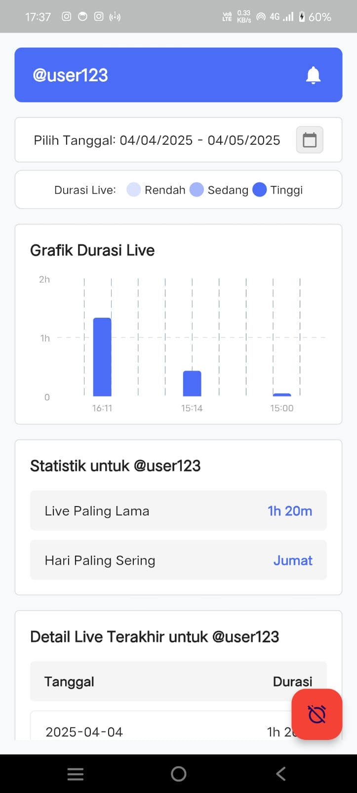
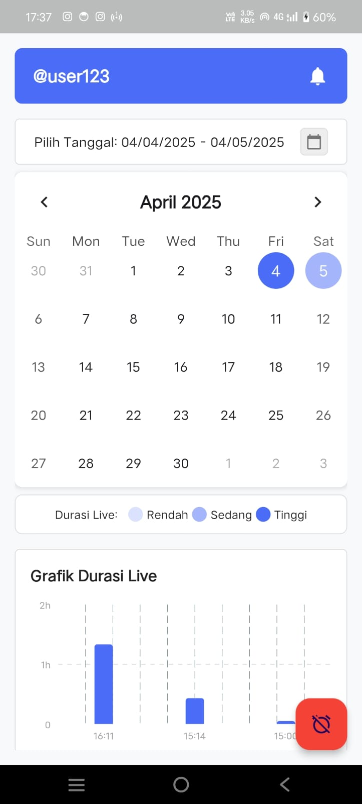
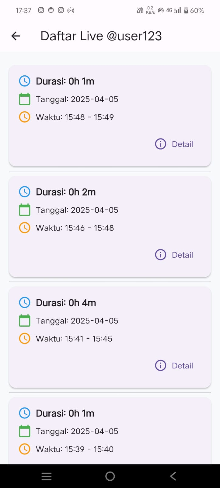

# Live Notifier

Live Notifier is a Flutter application that monitors TikTok live streams and sends notifications when a specific user goes live. It includes a comprehensive dashboard to track and analyze live sessions over time.

## Features

- Real-time notifications when a specified TikTok user goes live
- Detailed analytics dashboard for live sessions
- Calendar view to track live sessions by date
- Charts to visualize live session data
- Offline support with cached data
- Push notifications via Firebase Cloud Messaging
- Alarm functionality when live sessions start

## App Preview

### Dashboard


### Calendar View


### History View


## Table of Contents

- [Prerequisites](#prerequisites)
- [Installation](#installation)
  - [1. Clone the Repository](#1-clone-the-repository)
  - [2. Firebase Setup](#2-firebase-setup)
  - [3. FlutterFire Configuration](#3-flutterfire-configuration)
  - [4. Environment Variables](#4-environment-variables)
  - [5. Flutter Setup](#5-flutter-setup)
  - [6. Server Setup](#6-server-setup)
- [Project Structure](#project-structure)
- [Usage](#usage)
- [Troubleshooting](#troubleshooting)
- [Contributing](#contributing)
- [Contact](#contact)

## Prerequisites

- [Flutter](https://flutter.dev/docs/get-started/install) (2.5.0 or higher)
- [Node.js](https://nodejs.org/) (14.x or higher) for the backend server
- [Firebase account](https://firebase.google.com/)
- [FlutterFire CLI](https://firebase.flutter.dev/docs/cli/)
- [Git](https://git-scm.com/)

## Installation

### 1. Clone the Repository

```bash
git clone https://github.com/Motherbloods/Live-Push-Notification.git
cd Live-Push-Notification
```

### 2. Firebase Setup

#### 2.1 Create a Firebase Project

1. Go to the [Firebase Console](https://console.firebase.google.com/)
2. Click "Add project" and follow the setup wizard
3. Once created, add two apps to your Firebase project:
   - An Android app (and iOS if needed) for the Flutter client
   - A web app for the server-side application

#### 2.2 Generate Firebase Admin SDK Service Account

1. In the Firebase console, go to Project settings > Service accounts
2. Click "Generate new private key" and download the JSON file
3. Save it in your server directory (e.g., `nodejs/serviceAccount.json`)
4. This file will be used by your Node.js backend to authenticate with Firebase

#### 2.3 Firebase CLI Setup

1. Install Firebase CLI:
```bash
npm install -g firebase-tools
```

2. Login to Firebase:
```bash
firebase login
```

### 3. FlutterFire Configuration

#### 3.1 Install FlutterFire CLI

```bash
dart pub global activate flutterfire_cli
```

#### 3.2 Configure Firebase for Flutter

Run the FlutterFire configuration tool:

```bash
flutterfire configure
```

Follow the prompts:
1. Select your Firebase project
2. Select the platforms you're targeting (Android/iOS)
3. This will create a `firebase_options.dart` file in your project

### 4. Environment Variables

#### 4.1 Flutter App Environment

Create a `.env` file in the `assets` directory:

```
USERNAME_TIKTOK=username_to_monitor
URL=http://your-backend-url
```

#### 4.2 Backend Environment

Create a `.env` file in the backend directory:

```
PORT=3000
USERNAME_TIKTOK=@username_to_monitor
USERNAME_TELEGRAM=your_telegram_username
URLTARGET=https://www.tiktok.com
TELEGRAM_BOT_TOKEN=your_telegram_bot_token
MONGODB_URI=your_mongodb_connection_string
```

### 5. Flutter Setup

#### 5.1 Install Flutter Dependencies

```bash
flutter pub get
```

#### 5.2 Update Firebase Dependencies

Ensure your `pubspec.yaml` includes the following dependencies:

```yaml
dependencies:
  flutter:
    sdk: flutter
  firebase_core: ^latest_version
  firebase_messaging: ^latest_version
  http: ^latest_version
  flutter_dotenv: ^latest_version
  connectivity_plus: ^latest_version
  # Add other dependencies as needed
```

Run `flutter pub get` again to install any missing packages.

### 6. Server Setup

#### 6.1 Install Server Dependencies

```bash
cd nodejs
npm install
```

Required dependencies:
```bash
npm install express mongoose axios cheerio dotenv firebase-admin node-telegram-bot-api cookie-parser cors 
```

#### 6.2 Start the Server

```bash
node app.js
```

## Project Structure

```
/Live Push Notification
├── /flutter_live             # Aplikasi Flutter (client)
│   ├── /android              # File untuk platform Android
│   ├── /ios                  # File untuk platform iOS
│   ├── /assets               # Aset aplikasi dan file .env
│   └── /lib
│       ├── /models           # Model data
│       ├── /screens          # Halaman aplikasi
│       ├── /utils            # Fungsi utilitas
│       ├── /widgets          # Komponen widget yang dapat digunakan ulang
│       ├── firebase_options.dart   # Dihasilkan oleh FlutterFire CLI
│       └── main.dart         # Titik masuk utama aplikasi Flutter
│
├── /nodejs                  # Backend Node.js (server)
│   ├── /models              # Model database
│   ├── /routes              # Rute API
│   ├── /services            # Logika bisnis
│   ├── /utils               # Fungsi utilitas (termasuk firebase.js)
│   ├── serviceAccount.json    # Kredensial Firebase Admin
|   ├── .env                 # File konfigurasi environment untuk backend.
│   └── app.js             # Titik masuk utama backend
│
└── README.md                # Dokumentasi proyek ini
```

## Usage

### Running the Flutter App

```bash
cd flutter_live
flutter run
```

### Running the Server

```bash
cd nodejs
node app.js
```

### Monitoring Live Sessions

1. Open the app
2. The app will automatically check if the configured TikTok user is live
3. If the user goes live, you'll receive a push notification
4. Use the calendar view to see past live sessions
5. View analytics for live session frequency and duration

## Troubleshooting

### Push Notifications Not Working

- Ensure Firebase is correctly set up with FlutterFire
- Check if the FCM token is being sent to your backend
- Verify the backend is correctly sending notifications using the Firebase Admin SDK
- Check device permissions for notifications

### Live Status Not Updating

- Verify the backend can access the TikTok URL
- Check if the TikTok user exists and is public
- Ensure your MongoDB connection is working

### App Crashing on Start

- Make sure the Firebase configuration is correct
- Verify all dependencies are installed
- Check if the `.env` file is properly configured

## Contributing

1. Fork the repository
2. Create your feature branch (`git checkout -b feature/amazing-feature`)
3. Commit your changes (`git commit -m 'Add some amazing feature'`)
4. Push to the branch (`git push origin feature/amazing-feature`)
5. Open a Pull Request

## 📬 Contact

For questions, support, or contributions, feel free to reach out:

- 👤 **Developer**: Habib Risky Kurniawan (a.k.a. `motherbloodss`)
- 📧 **Email**: [habibskh06@gmail.com](mailto:habibskh06@gmail.com)
- 💻 **GitHub**: [Motherbloods](https://github.com/Motherbloods)

If you encounter bugs or want to request new features, please open an [Issue](https://github.com/Motherbloods/Live-Push-Notification/issues).

